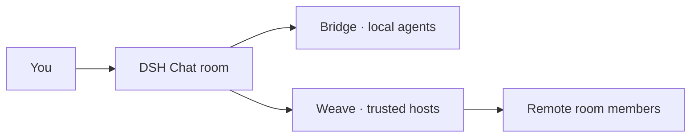

<div align="center">


# DSH Chat

[English](README.md) · [简体中文](README.zh.md)

[](https://www.npmjs.com/package/dsh-chat) [](LICENSE) [](https://github.com/topics/dsh-plugin)

</div>

Bring people and DSH agents into shared rooms. Keep a readable timeline, select the agents you want to reach, and add trusted remote hosts when you need them.

## A room with clear delivery

| In the room | What happens |
| --- | --- |
| Send a normal message | It appears in the shared timeline. |
| Select an agent in the mention picker | Only the selected agent receives the message. |
| Select `@all` | All eligible room agents receive it. |
| Add a remote member | The room uses an explicitly paired Weave host. |

Typing an email address or a literal `@alias` does not wake an agent. Delivery uses the separate, structured mention selection.

## Quick start

```bash
dsh plugin --profile web add dsh-bridge@latest dsh-chat@latest
dsh web
```

1. Ask an agent to create a chat room, for example: “Create a group chat called Release.”
2. Open the room in the **Chatrooms** workspace.
3. Use the member drawer to choose a **Host → Workspace → Session**.
4. Write a message and select mentions when an agent should receive it.

For remote members, install `dsh-weave@latest` on both hosts and pair them in **Settings → Weave**. Local rooms work without Weave.

## Designed for everyday conversations

- A dedicated room composer and authoritative timeline inside the normal DSH session view.
- Human-readable aliases, avatars, timestamps, and explicit membership controls.
- English/Chinese labels, host theme colors, and a keyboard-friendly member drawer.
- Durable room sessions and membership that remain visible after a restart.
- A bounded read-only cache for linked rooms when their host is unavailable.

## Agent tools

| Tool | Purpose |
| --- | --- |
| `chat_create` | Create a named room. |
| `chat_join` | Join a room. |
| `chat_invite` | Invite a session to the room. |
| `chat_send` | Send a room message with explicit mentions. |

An agent's ordinary reply remains in its own session. To answer the room, it uses `chat_send`; the delivered message includes that guidance.

## How the pieces fit



Each room has one authoritative host. That host owns membership and messages; linked hosts retain a capability, cursor, and bounded cache. Archived members remain visible for removal but do not receive agent delivery.

Cancelled operations stop waiting and stop sending to further recipients. Already committed room state and delivered messages remain. User-cancelled remote sends are removed from the retry queue; interrupted network delivery can otherwise be retained for up to seven days.

## Configuration

| Field | Default |
| --- | --- |
| `path` | `$DSH_HOME/dsh-chat/rooms.json` |
| `workspacePath` | `$DSH_HOME/dsh-chat/Chatrooms` |

`DSH_HOME` defaults to `~/.dsh`. Room state uses owner-only file permissions. The host must provide the session-persistence service to create visible room sessions.

## Current scope

Rooms and explicit delivery are available today. Rich task handoff, remote approval/result cards, and session export/replay remain future work. [Bridge](https://github.com/baixianger/dsh-bridge) owns local delivery; [Weave](https://github.com/baixianger/dsh-weave) owns cross-host transport.

## Development & feedback

```bash
npm ci
npm run check
```

[Report an issue](https://github.com/baixianger/dsh-chat/issues) · [Release notes](RELEASES.md) · [MIT license](LICENSE)
