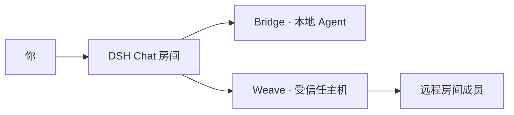

<div align="center">


# DSH Chat

[English](README.md) · [简体中文](README.zh.md)

[](https://www.npmjs.com/package/dsh-chat) [](LICENSE) [](https://github.com/topics/dsh-plugin)

</div>

让人与 DSH Agent 在同一个房间协作。共享清晰的消息时间线，明确选择需要联系的 Agent，也可以加入受信任的远程主机成员。

## 每条消息都有明确去向

| 在房间中操作 | 实际行为 |
| --- | --- |
| 发送普通消息 | 只显示在共享时间线中。 |
| 在提及选择器中选择 Agent | 只向选中的 Agent 投递。 |
| 选择 `@all` | 向房间内所有符合条件的 Agent 广播。 |
| 添加远程成员 | 使用已明确配对的 Weave 主机。 |

直接输入邮箱或字面上的 `@别名` 不会唤醒 Agent；投递以单独的结构化提及选择为准。

## 快速开始

```bash
dsh plugin --profile web add dsh-bridge@latest dsh-chat@latest
dsh web
```

1. 请 Agent 创建房间，例如：“创建一个叫‘发布协作’的群聊。”
2. 在 **Chatrooms** 工作区打开房间。
3. 从成员抽屉按 **主机 → 工作区 → 会话** 选择成员。
4. 输入消息，需要 Agent 接收时再明确选择提及对象。

使用远程成员时，在两台主机安装 `dsh-weave@latest`，并在 **设置 → Weave** 完成配对。本地房间无需 Weave。

## 为日常协作设计

- 在正常 DSH 会话视图内提供专用聊天输入框和权威时间线。
- 成员别名、头像、时间戳，以及明确的成员管理入口。
- 中英文、宿主主题颜色和支持键盘操作的成员抽屉。
- 持久保存房间会话与成员关系，重启后仍可见。
- 远程房间主机暂时不可达时，保留有界的只读历史缓存。

## Agent 工具

| 工具 | 用途 |
| --- | --- |
| `chat_create` | 创建命名房间。 |
| `chat_join` | 加入房间。 |
| `chat_invite` | 邀请会话加入房间。 |
| `chat_send` | 发送房间消息，并明确选择提及对象。 |

Agent 的普通回复留在自己的会话中。回复房间需要调用 `chat_send`，收到的消息会附带这条说明。

## 各部分如何协作



每个房间只有一个权威主机，负责成员和消息；其他主机保存房间权限、游标和有界缓存。已归档的成员仍可供移除，但不再接收 Agent 投递。

取消操作会结束等待并停止向后续成员发送；已提交状态和已送达消息保留。用户主动取消的远程发送会移出重试队列；其他因网络中断而待投递的定向消息最多保留七天。

## 配置

| 字段 | 默认值 |
| --- | --- |
| `path` | `$DSH_HOME/dsh-chat/rooms.json` |
| `workspacePath` | `$DSH_HOME/dsh-chat/Chatrooms` |

`DSH_HOME` 默认是 `~/.dsh`。房间状态使用仅所有者可访问的文件权限；创建可见房间会话需要宿主的 session-persistence 服务。

## 当前范围

已支持房间和明确投递。丰富的任务交接、远程审批/结果卡片、会话导出与回放仍属后续工作。[Bridge](https://github.com/baixianger/dsh-bridge) 负责本地投递，[Weave](https://github.com/baixianger/dsh-weave) 负责跨主机传输。

## 开发与反馈

```bash
npm ci
npm run check
```

[提交问题](https://github.com/baixianger/dsh-chat/issues) · [版本记录](RELEASES.md) · [MIT 许可证](LICENSE)
